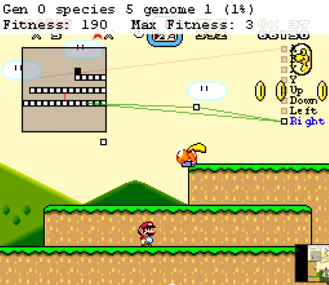
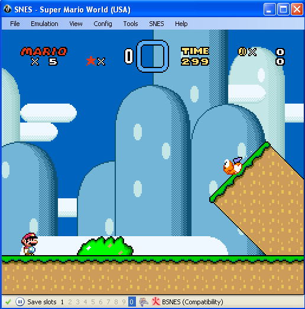

I was recently intrigued by [Seth Bling's MarI/O](https://www.youtube.com/watch?v=qv6UVOQ0F44) - a neural network slash genetic algorithm that teaches itself to play Super Mario World.

Seth's implementation (in Lua) is based on the concept of NeuroEvolution of Augmenting Topologies (or NEAT). [NEAT](https://en.wikipedia.org/wiki/Neuroevolution_of_augmenting_topologies) is a type of genetic algorithm which generates efficient artificial neural networks (ANNs) from a very simple starting network. It does so rather quickly too (compared to other evolutionary algorithms).

For another example of why this field is incredibly exciting, [watch this amazing video of Google's DeepMind learning and mastering space invaders](https://www.youtube.com/watch?v=rbsqaJwpu6A&t=10m33s). How good is that clutch shot at the end?!

Seth's MarI/O can play both Super Mario World (SNES), and Super Mario Bros (NES). If you want to try it out yourself, read on.

## Setup (Windows 8.1)

To evolve your own ANN with MarI/O that can play Super Mario World, here's how to do it;

### Installation

1. Install [BizHawk Prereqs](http://sourceforge.net/projects/bizhawk/files/Prerequisites/bizhawk_prereqs_v1.1.zip/download)

1. Download and unzip [BizHawk](http://sourceforge.net/projects/bizhawk/)

1. Get a copy of [Seth's MarI/O](http://pastebin.com/ZZmSNaHX) (call it neatevolve.lua )

1. Put neatevolve.lua in the root folder of your BizHawk folder. (In the same dir as the EmuHawk executable.)

### Emulator Setup

1. Set BizHawk video Mode to OpenGL (not GDI+)

   Config > Display > Display Method > Open GL

1. Restart BizHawk for settings to take effect. Double check it actually works.

1. Optional: Set emulation speed to 200% - this makes the evolution go a lot faster!

### Initial State Setup

We need an initial/fresh game state that gets loaded for each genome. In other words, we need to save the ROM state at the start of the desired level we want MarI/O to learn.

1. Load the Super Mario World (USA).sfc ROM.

1. Start a new game

1. Go to the level you want MarI/O to learn. I chose Yoshi's Island #1.

1. Use the File -> Save Named State -> Save As "DP1.state" in the BizHawk root folder (i.e. in the same dir as neatevolve.lua).

Now we have an initial state that MarI/O will load before each genome is evaluated.

### Running MarI/O

1. Load neatevolve.lua. You can do this via Tools->Lua Console. I prefer to drag and drop neatevolve.lua into the running emulator.

1. MarI/O will load, creating a base set of about 300 very simple genomes. This is as per the NEAT methodology, which starts with a very simple ANNs (i.e. very few hidden nodes), and evolves from there.

1. You can see the ANN that MarI/O is currently evaluating by checking 'Show Map' setting in the MarI/O 'Fitness' window.

Congratulations! If all goes well you'll see Mario sitting there or jumping up and down, like an idiot, while it learns how to play the game. Don't worry, it gets 'smarter'.

### Restarting MarI/O

MarI/O saves the genomes of a given generation in a .pool file. The current generation being evaluated is saved in temp.pool. After each generation, a new .pool file will be saved, prefixed with the generation number.

If your computer melts, and you need to restart MarI/O;

1. Delete temp.pool
1. Copy the desired generation .pool file to DP1.state.pool
1. In the MarI/O 'Fitness' window, load the DP1.state.pool
1. MarI/O should resume from the latest complete generation.

## Troubleshooting

Here are solutions to common errors myself an other people have ran into with MarI/O.

### 'Buttonnames' error

      LuaInterfae.LuaScriptException: [string "main"]:33: attempt to get length of global 'ButtonNames' (a nil value)

The NEATevolve.lua script has a hardcoded (and relative) file reference to DP1.state. You need to make sure these files are in the same directory.

1. Create a Save State in BizHawk at the start of the level you want the algorithm to learn.

1. you'll need to rename that file to DP1.state, and drop it in the same directory as the neatevolve.lua script. Putting both these files in the same directory as EmuHawk.exe is recommended

[Source discusson on reddit](https://www.reddit.com/r/videos/comments/39qel5/top_super_mario_speedrunner_teaches_computer_to/cs5nfy5)

### 'neurons' error

      LuaInterface.LuaScriptException: [string "main"]:337: attempt to index field 'neurons' (a nil value)

A similar error - try the solution above, and failing that;

1. As above create a quicksave at the start of a level Renamed the QuickSave1.state found in /SNES/State/ to DP1.state and move it to the folder with the EmuHawk executable.

1. Put the neatevolve.lua file in the same folder as EmuHawk.exe.

1. Noticed while I was testing that it generated a temp.pool file that seemed to have all the variables in it. Renamed that file to DP1.state.pool

[Source discussion on reddit](https://www.reddit.com/r/videos/comments/39qel5/top_super_mario_speedrunner_teaches_computer_to/cs5xvbh)

### 'Parameter name: source' error

      "System.ArgumentNullException: Value cannot be null. Parameter name: source"

Are you running MarI/O in a VM? Check out my notes on [running MarI/O on OSX](/posts/tech/2015/07/08/mario-on-osx.html)

## Resources

Check out these discussions for more info on MarI/O

- [Seth's MarI/O frontpage post on /r/videos](https://www.reddit.com/r/videos/comments/39qel5/top_super_mario_speedrunner_teaches_computer_to/?limit=500)

- [/r/machinelearning discussion](https://www.reddit.com/r/MachineLearning/comments/39qk6h/machine_learning_used_to_play_super_mario_world/)c
